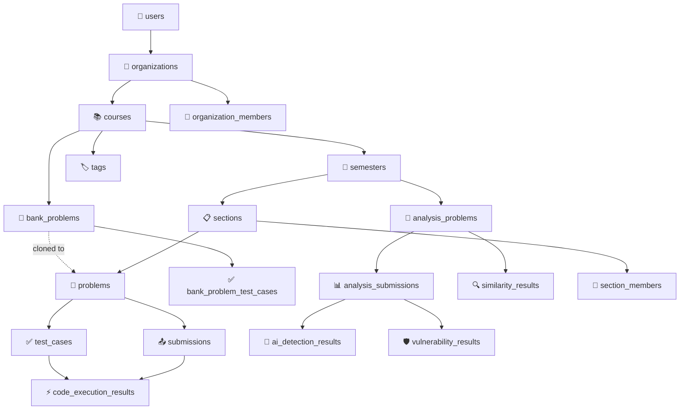

# MageCode 2.0 — Entity Relationship Diagram

## Full ERD

```mermaid
erDiagram
    users {
        bigint id PK
        varchar username UK
        varchar email UK
        varchar password
        varchar first_name
        varchar last_name
        varchar student_id UK
        varchar avatar_path
        timestamp email_verified_at
        boolean is_first_time_register
        timestamp created_at
        timestamp updated_at
    }

    organizations {
        bigint id PK
        varchar name
        text description
        varchar email
        varchar avatar_path
        bigint creator_id FK
        timestamp created_at
        timestamp updated_at
    }

    courses {
        bigint id PK
        bigint organization_id FK
        varchar code
        varchar name
        text description
        boolean require_bank_approval
        bigint creator_id FK
        timestamp created_at
        timestamp updated_at
    }

    semesters {
        bigint id PK
        bigint course_id FK
        varchar name
        text description
        varchar publish_mode
        varchar lock_mode
        boolean allow_publish_override
        boolean allow_lock_override
        decimal similarity_threshold
        decimal ai_detection_threshold
        date start_date
        date end_date
        bigint creator_id FK
        timestamp created_at
        timestamp updated_at
    }

    sections {
        bigint id PK
        bigint semester_id FK
        varchar name
        text description
        bigint creator_id FK
        timestamp created_at
        timestamp updated_at
    }

    problems {
        bigint id PK
        bigint section_id FK
        bigint bank_problem_id FK
        bigint creator_id FK
        varchar name
        text description
        varchar difficulty
        varchar group_label
        integer order
        integer max_submissions
        integer time_limit
        integer memory_limit
        timestamp activation_time
        timestamp lock_time
        varchar publish_mode_override
        varchar lock_mode_override
        boolean is_published
        boolean is_locked
        uuid manual_match_group_id
        timestamp testcases_updated_at
        timestamp deleted_at
    }

    submissions {
        bigint id PK
        bigint problem_id FK
        bigint creator_id FK
        bigint programming_language_id FK
        varchar file_path
        varchar file_name
        varchar execution_status
        integer testcases_passed
        integer testcases_total
        boolean is_outdated
        timestamp created_at
        timestamp updated_at
    }

    test_cases {
        bigint id PK
        bigint problem_id FK
        text input
        text expected_output
        boolean is_active
        boolean is_visible
        integer order
    }

    programming_languages {
        bigint id PK
        varchar name
        varchar version
        integer judge0_id
        varchar monaco_language
        varchar dolos_language
        varchar codeql_language
    }

    bank_problems {
        bigint id PK
        bigint course_id FK
        bigint author_id FK
        bigint original_id FK
        varchar name
        text description
        varchar difficulty
        integer time_limit
        integer memory_limit
        integer version
        varchar status
        timestamp deleted_at
    }

    bank_problem_test_cases {
        bigint id PK
        bigint bank_problem_id FK
        text input
        text expected_output
        boolean is_active
        boolean is_visible
        integer order
    }

    analysis_problems {
        bigint id PK
        bigint semester_id FK
        bigint bank_problem_id FK
        uuid manual_match_group_id
        bigint triggered_by_problem_id FK
        bigint analyst_id FK
        jsonb services
        varchar status
        boolean is_latest
        boolean is_partial
        timestamp started_at
        timestamp completed_at
    }

    analysis_submissions {
        bigint id PK
        bigint submission_id FK
        bigint analysis_problem_id FK
        varchar plagiarism_status
        varchar ai_detection_status
        varchar vuln_scan_status
        timestamp started_at
        timestamp completed_at
    }

    code_execution_results {
        bigint id PK
        bigint submission_id FK
        bigint test_case_id FK
        varchar status
        text actual_output
        decimal consumed_time_ms
        integer consumed_memory_kb
        text error_content
        timestamp created_at
    }

    similarity_results {
        bigint id PK
        bigint analysis_problem_id FK
        bigint submission_a_id FK
        bigint submission_b_id FK
        decimal similarity
        integer longest_fragment
        integer total_overlap
        varchar match_type
        text a_regions
        text b_regions
    }

    ai_detection_results {
        bigint id PK
        bigint analysis_submission_id FK
        decimal probability
        timestamp created_at
    }

    vulnerability_results {
        bigint id PK
        bigint analysis_submission_id FK
        varchar name
        text description
        varchar severity
        varchar file_path
        integer start_line
        integer start_column
        integer end_line
        integer end_column
    }

    organization_members {
        bigint id PK
        bigint organization_id FK
        bigint user_id FK
        varchar role
        bigint added_by FK
        timestamp created_at
    }

    section_members {
        bigint id PK
        bigint section_id FK
        bigint user_id FK
        varchar role
        bigint added_by FK
        timestamp created_at
    }

    tags {
        bigint id PK
        bigint course_id FK
        varchar name
        varchar color
    }

    problem_programming_languages {
        bigint problem_id FK
        bigint programming_language_id FK
    }

    bank_problem_programming_languages {
        bigint bank_problem_id FK
        bigint programming_language_id FK
    }

    bank_problem_tags {
        bigint bank_problem_id FK
        bigint tag_id FK
    }

    problem_tags {
        bigint problem_id FK
        bigint tag_id FK
    }

    problem_edit_logs {
        bigint id PK
        bigint problem_id FK
        bigint edited_by FK
        varchar field_changed
        text old_value
        text new_value
        timestamp edited_at
    }

    section_transfer_logs {
        bigint id PK
        bigint user_id FK
        bigint from_section_id FK
        bigint to_section_id FK
        bigint transferred_by FK
        timestamp transferred_at
    }

    notifications {
        uuid id PK
        varchar type
        varchar notifiable_type
        bigint notifiable_id
        text data
        timestamp read_at
    }

    %% === Core Hierarchy ===
    users ||--o{ organizations : "creates"
    organizations ||--o{ courses : "contains"
    courses ||--o{ semesters : "has"
    semesters ||--o{ sections : "has"
    sections ||--o{ problems : "contains"
    problems ||--o{ submissions : "receives"
    problems ||--o{ test_cases : "has"

    %% === Creator FKs ===
    users ||--o{ courses : "creates"
    users ||--o{ semesters : "creates"
    users ||--o{ sections : "creates"
    users ||--o{ problems : "creates"
    users ||--o{ submissions : "submits"

    %% === Problem Bank ===
    courses ||--o{ bank_problems : "owns"
    users ||--o{ bank_problems : "authors"
    bank_problems ||--o{ bank_problems : "versions"
    bank_problems ||--o{ bank_problem_test_cases : "has"
    bank_problems ||--o{ problems : "cloned to"

    %% === Submissions & Execution ===
    programming_languages ||--o{ submissions : "used in"
    submissions ||--o{ code_execution_results : "produces"
    test_cases ||--o{ code_execution_results : "tested by"

    %% === Analysis ===
    semesters ||--o{ analysis_problems : "scoped to"
    problems ||--o{ analysis_problems : "triggers"
    users ||--o{ analysis_problems : "triggers"
    analysis_problems ||--o{ analysis_submissions : "contains"
    submissions ||--o{ analysis_submissions : "analyzed in"
    analysis_problems ||--o{ similarity_results : "produces"
    submissions ||--o{ similarity_results : "compared as A"
    submissions ||--o{ similarity_results : "compared as B"
    analysis_submissions ||--o{ ai_detection_results : "produces"
    analysis_submissions ||--o{ vulnerability_results : "produces"

    %% === Membership ===
    organizations ||--o{ organization_members : "has"
    users ||--o{ organization_members : "member of"
    sections ||--o{ section_members : "has"
    users ||--o{ section_members : "member of"

    %% === Tags & Pivots ===
    courses ||--o{ tags : "defines"
    problems ||--o{ problem_programming_languages : "supports"
    programming_languages ||--o{ problem_programming_languages : "used by"
    bank_problems ||--o{ bank_problem_programming_languages : "supports"
    programming_languages ||--o{ bank_problem_programming_languages : "used by"
    bank_problems ||--o{ bank_problem_tags : "tagged"
    tags ||--o{ bank_problem_tags : "applied to"
    problems ||--o{ problem_tags : "tagged"
    tags ||--o{ problem_tags : "applied to"

    %% === Audit ===
    problems ||--o{ problem_edit_logs : "tracked by"
    users ||--o{ problem_edit_logs : "edited by"
    users ||--o{ section_transfer_logs : "transferred"
    sections ||--o{ section_transfer_logs : "from"
    sections ||--o{ section_transfer_logs : "to"
```

## Simplified View — Core Hierarchy

```mermaid
graph TD
    U["👤 users"] --> O["🏢 organizations"]
    O --> C["📚 courses"]
    C --> S["📅 semesters"]
    S --> SEC["📋 sections"]
    SEC --> P["📝 problems"]
    P --> SUB["📤 submissions"]
    SUB --> CER["⚡ code_execution_results"]
    P --> TC["✅ test_cases"]
    TC --> CER

    C --> BP["🏦 bank_problems"]
    BP --> BPTC["✅ bank_problem_test_cases"]
    BP -.->|"cloned to"| P

    S --> AP["🔬 analysis_problems"]
    AP --> AS["📊 analysis_submissions"]
    AS --> AID["🤖 ai_detection_results"]
    AS --> VUL["🛡️ vulnerability_results"]
    AP --> SIM["🔍 similarity_results"]

    O --> OM["👥 organization_members"]
    SEC --> SM["👥 section_members"]
    C --> T["🏷️ tags"]
```
